# ODOO ASIER ARANDA Y MARIO MUÑOZ

# **STRONG**

Para comenzar, vamos a hacer uan breve explicacion de nuestra pagina web.
Se trata de la página web de una empresa de gimnasios, la cual se llama Strong.....

1: EXPLICACIÓN DE LA PÁGINA WEB:
* Lo primero que hicimos, fue una seleccion de tema entre todos los posibles, centrándonos en el que más se adaptase al estilo que queríamos para nuestra web. Elegimos uno, pero no podíamos implementarlo, ya que daba error, por lo que tuvimos que dejar el que venía por defecto.

La página principal de nuestra web es asi:
* El número 1, muestra el nombre de nuestra web.
* El número 2, muestra el logo de la empresa y a continuación el menú de navegacion de la web.
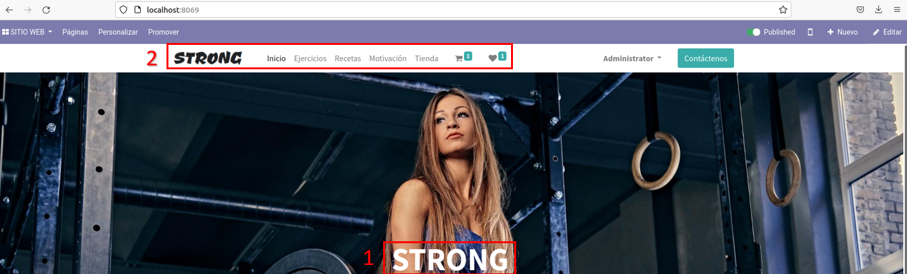

Enlaces directos hacia las secciones de nuestra web, las mismas que se muestran en la barra de navegación.
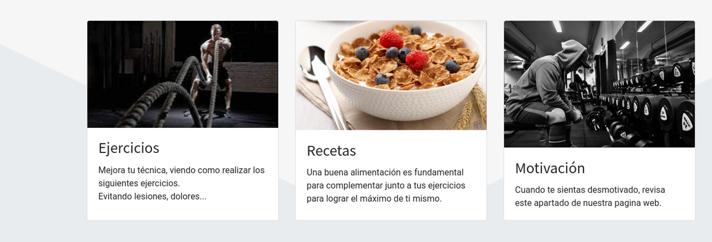
Se muestran las distintas ofertas de cuotas en un menú de 3 columnas:
* Hemos diseñado los botones de "Comprar" adaptados al tema de nuestra web, lo hemos hecho mediante HTML, CSS y JavaScript.
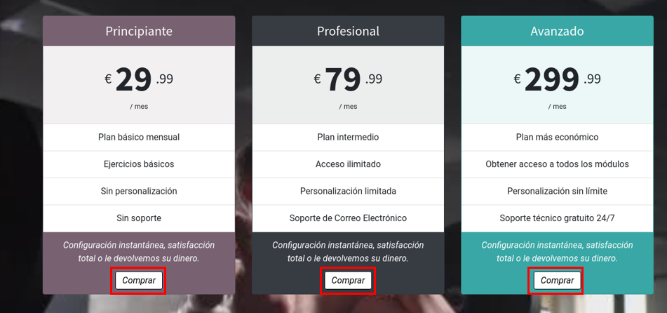
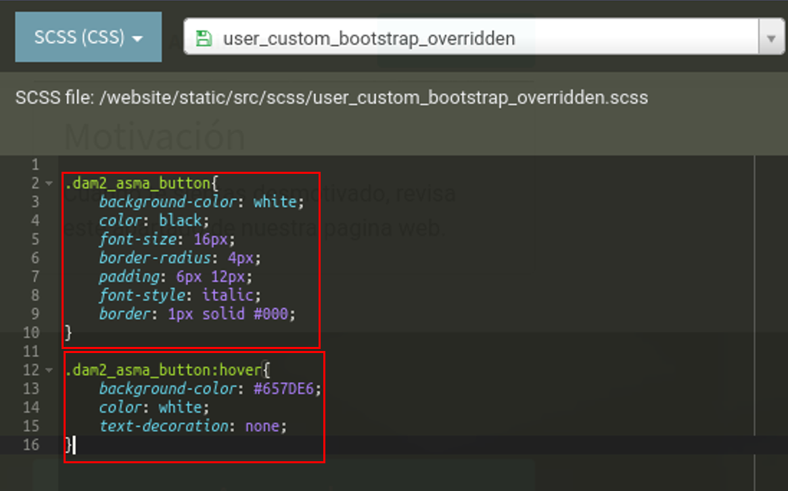
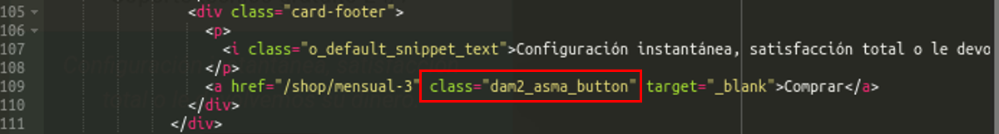
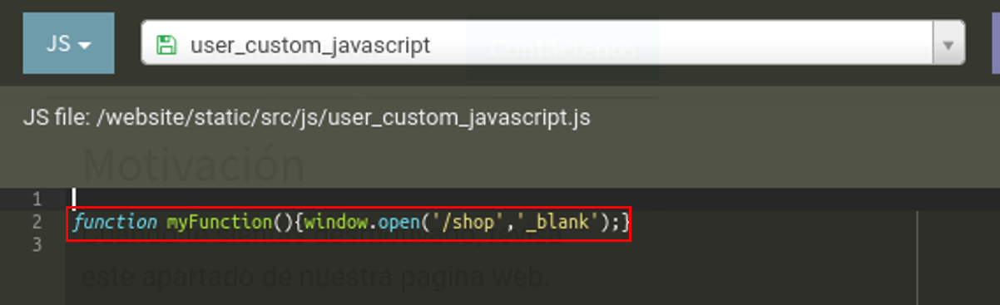

En la parte inferior de la página, hemos añadido un "footer", en el cual incluimos una pequeña descripción de nuestra web, junto con los links de interés y datos de contacto.
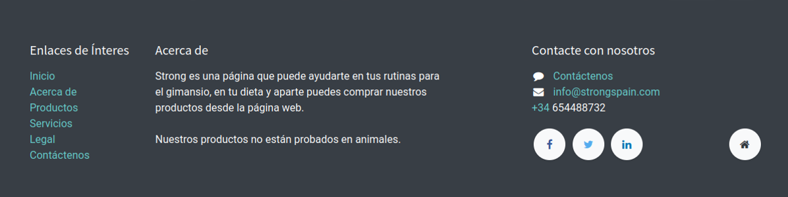

_________________________

A continuación de inicio, tenemos el apartado de ejercicios.
Primeramente, vemos una pequeña descripción de lo que nos vamos a encontrar a continuación, y un enlace directo hacia el formulario de contacto par solucionar al cliente cualquier tipo de duda.
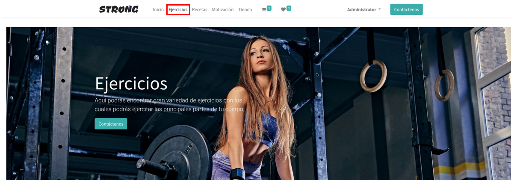
Para separar los diferentes tipos de ejercicios hemos utilizado un "carrusel".
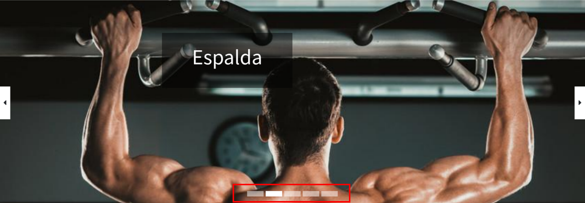
_________________________

En el apartado de recetas, en primer lugar hemos hecho un pequeño "collage" con dos fotos, en las cuales introducimos una foto en el "background" y un texto explicativo de cada receta.
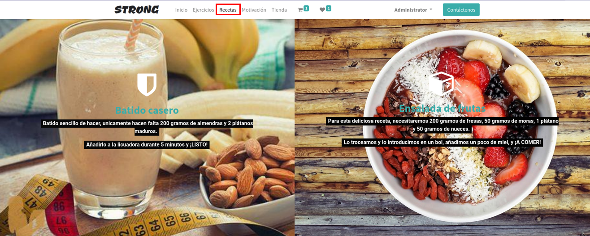
En segundo lugar, tenemos una lista, en la que hemos explicado una especi de menú.
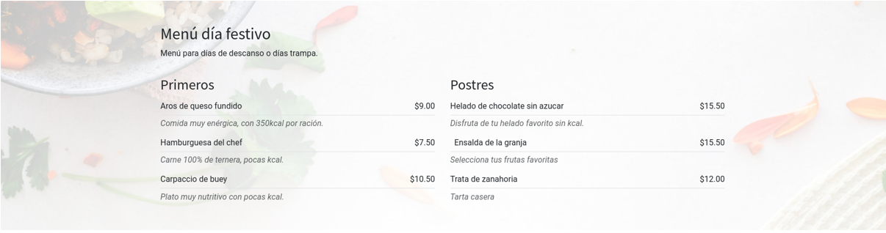
Por último, hemos hecho un apartado de nutricionista online, el cual tiene un botón que nos dirige hacia un formulario de contacto.
De fondo tenemos una imagen con el efecto "parallax".
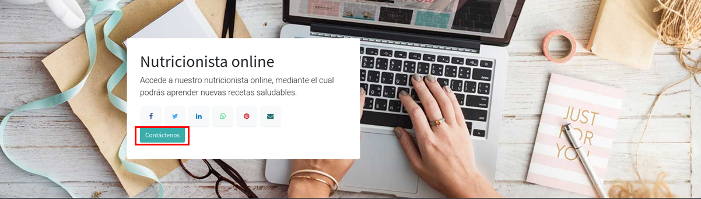
_________________________

En el apartado de motivación, hemos situado en primer lugar el bloque llamado "team" en el que mostramos personas de nuestra empresa, en las que explicamos su función, o algún hecho relevante de su carrera, para que sirva de motivación a los nuevos clientes.
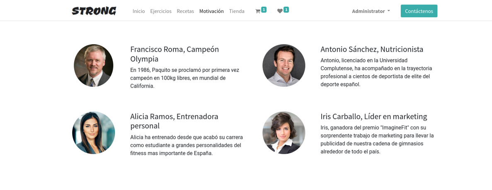
En segundo lugar, tenemos un "timeline", el cual nos indica los hechos más importantes de nuestra empresa.
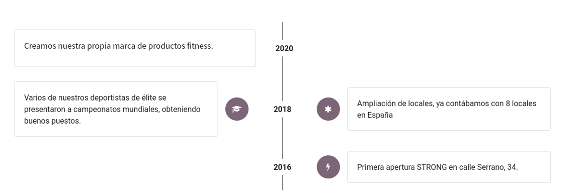
Por último, hemos implementado un bloque "quotes" con frases motivadoras.
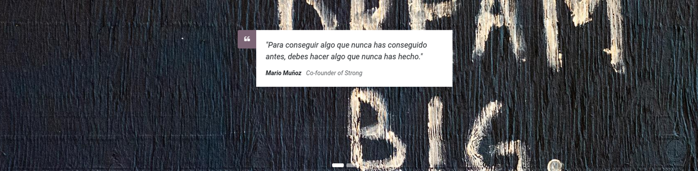
_________________________
Por último en el apartado de tienda, tenemos 3 "steps" en los cuales se explica de manera muy resumida los pasos a seguir para realizar la compra de cualquier producto o servicio de nuestra web.
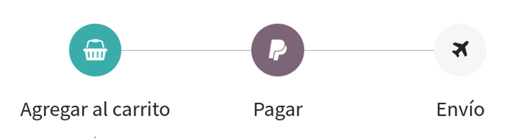
A continuación, tenemos mostrados todos los productos y servicios que vendemos.
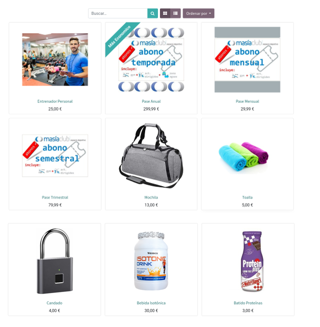
Como se puede observar "Pase Anual" tiene una etiqueta verde, este efecto se llama "ribbon" y es una forma de destacar el producto.
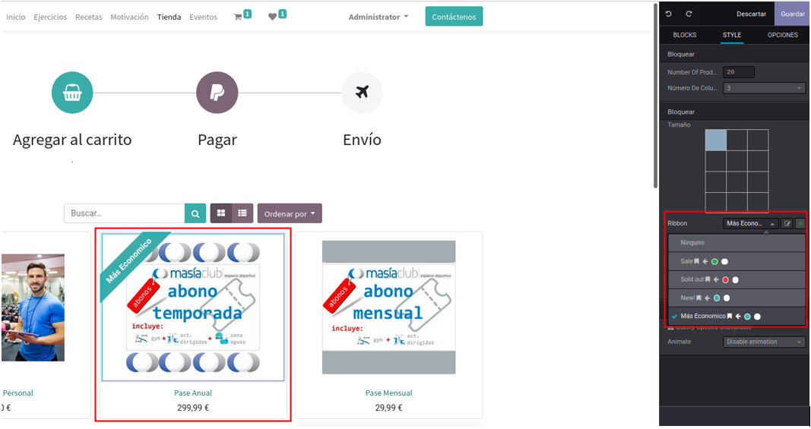
Cuando pinchamos en un producto 