# ODOO ASIER ARANDA Y MARIO MUÑOZ

# **STRONG**

## **9. Implanta los mecanismos de control de versiones y copia de seguridad del sistema.**

**9.0. Desde nuestro ODOO accedemos a "MANAGE DATABASE" y pulsamos el botón "BACKUP"**

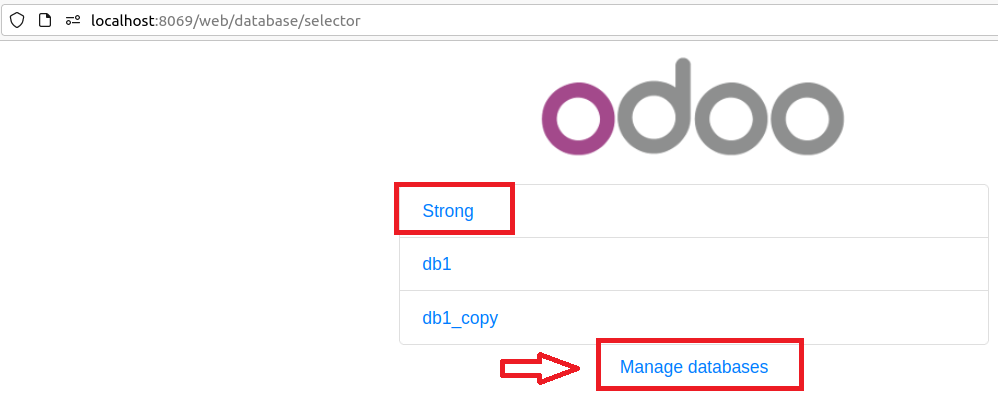
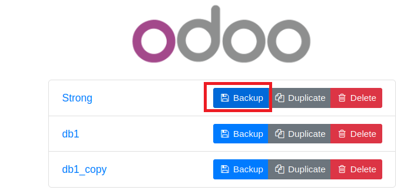

**9.1. hacer backup y encriptar**

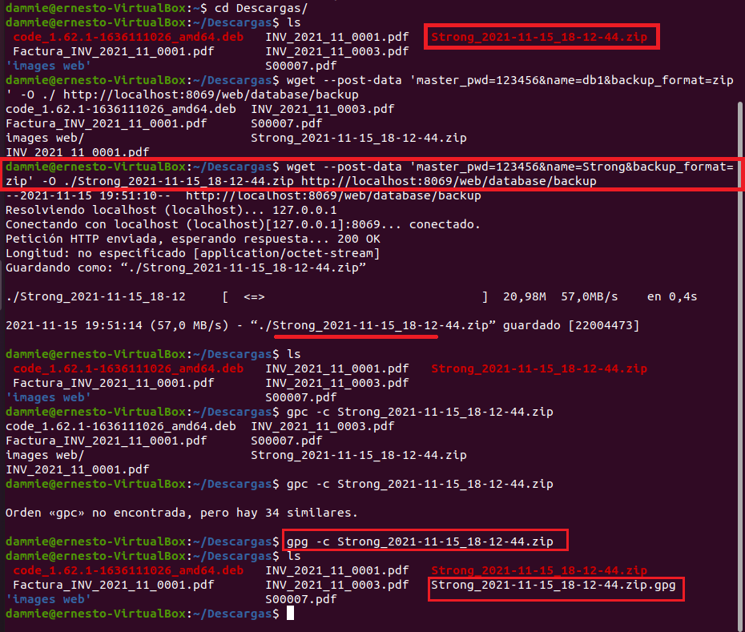

**9.2. mover el fichero a dumps**

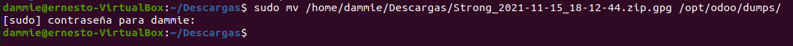

**9.3. nos conectamos con usuario odoo y vamos a la carpeta dumps para hacer git status**

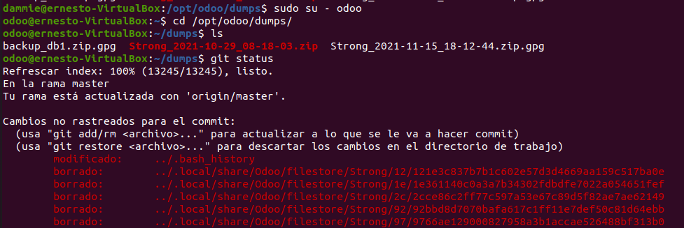

**9.4. git add and git commit**

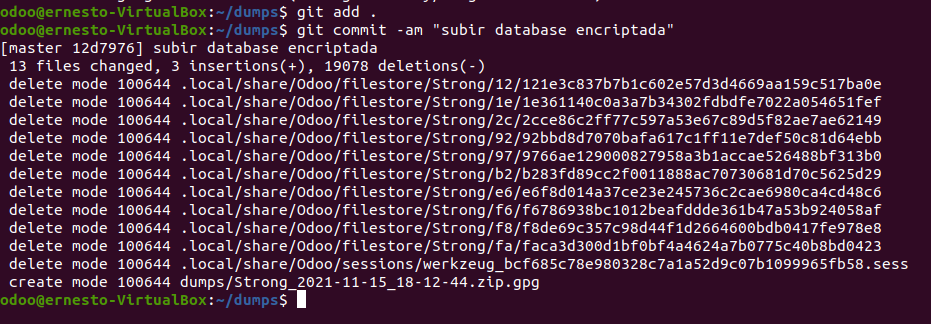

**9.5. creo mi branch**

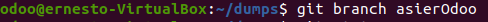

**9.6. estoy en master**  

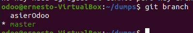

**9.7.  cambiado a mi rama**

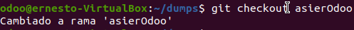

**9.8.  git push nuevo**

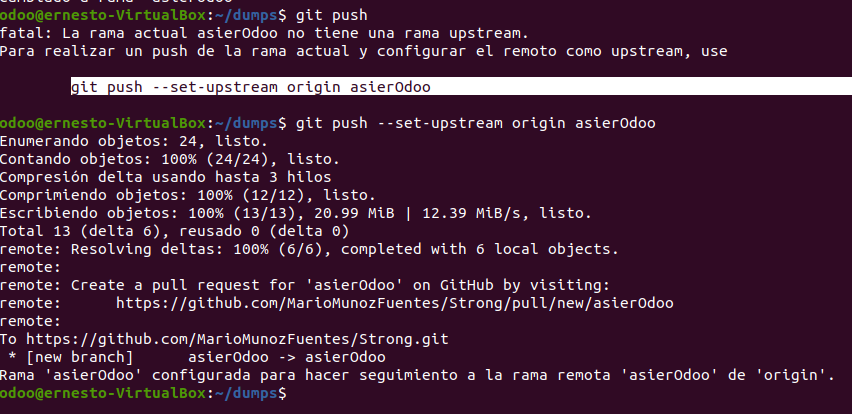

**9.9.  Y ya desde github podemos comprobar que tenemos guardado la copia del proyecto**    
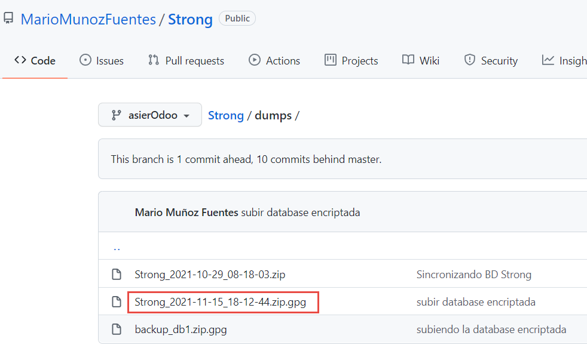

## 10. hola

